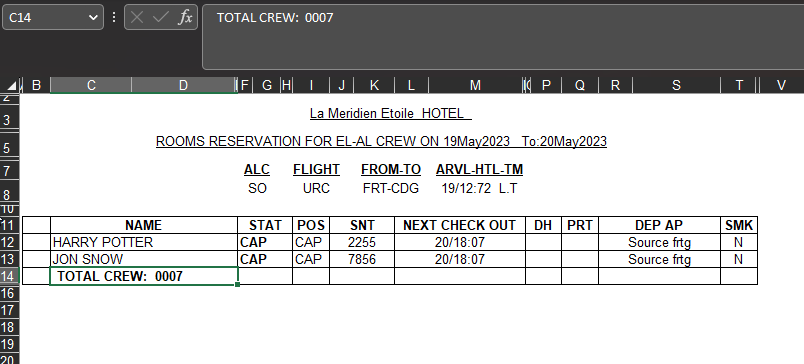
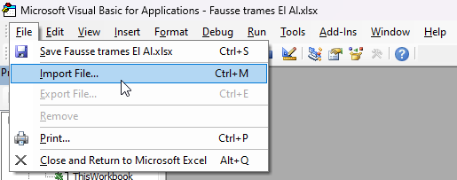
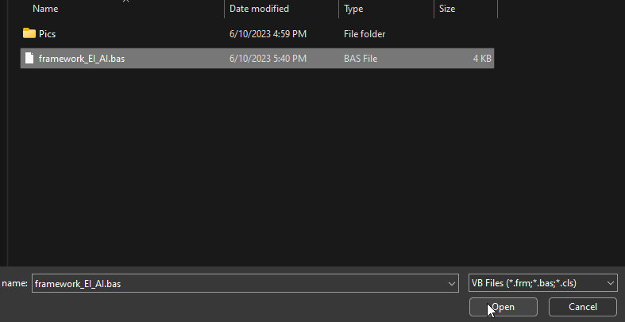
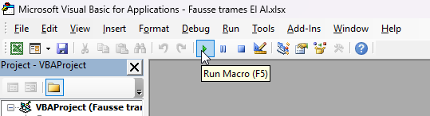
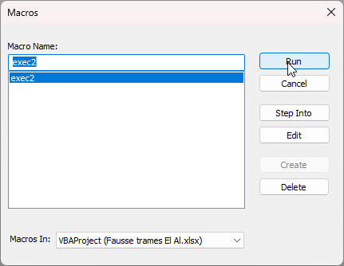

# Script EI AI framework

The script automatically resizes the Excel file to meet the printing requirements.

- Open the excel file.
  
- ALT + F11
- File -> Import File (Ctrl + M)
  
- Open framework_EI_AI.bas
  
- Run Macro (F5)
  
- Run (Enter)
  